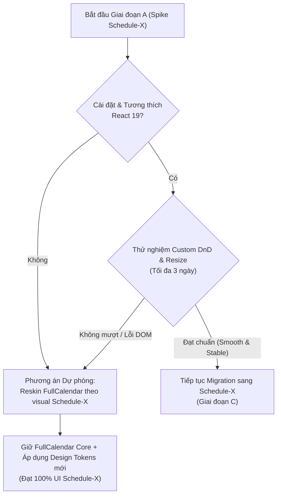
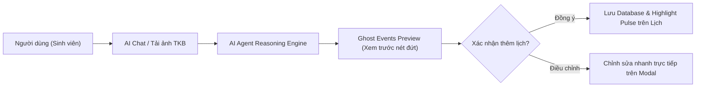

# BẢNG TỔNG HỢP RỦI RO, GỢI Ý TỐI ƯU UI/UX & CHIẾN LƯỢC TÍCH HỢP AI AGENT
## Dự án: Redesign Frontend Planora (AI Calendar Agent)

---

## 1. Ma trận Rủi ro Tổng quan (Risk Matrix)

| ID | Rủi ro | Phân loại | Khả năng xảy ra | Mức độ ảnh hưởng | Mức độ rủi ro | Trạng thái |
|---|---|---|---|---|---|---|
| **R-01** | Khó khăn khi tự xây dựng Drag & Drop và Resize trên Schedule-X Free | Kỹ thuật | **Cao** | **Nghiêm trọng** | 🔴 **Cực cao** | Cần Spike ngay |
| **R-02** | Xung đột tương thích giữa Schedule-X và React 19 / Vite | Kỹ thuật | **Trung bình** | **Cao** | 🟠 **Cao** | Cần kiểm tra sớm |
| **R-03** | Sai lệch dữ liệu chuỗi lặp (RRule) và Múi giờ (Timezone/Temporal) | Kỹ thuật / Dữ liệu | **Trung bình** | **Cao** | 🟠 **Cao** | Cần kiểm thử tự động |
| **R-04** | Bất đồng bộ trạng thái giữa AI Agent Chat và Calendar (Race Condition) | Logic / Luồng | **Trung bình** | **Trung bình** | 🟡 **Trung bình** | Đã có cơ chế rollback |
| **R-05** | Nhầm lẫn thị giác giữa màu Brand (Đỏ Hồng) và trạng thái Lỗi/Cảnh báo | UI / UX | **Cao** | **Trung bình** | 🟡 **Trung bình** | Giải quyết ở Design Token |
| **R-06** | Vỡ layout hoặc quá tải thông tin trên các màn hình desktop khác nhau | UI / Responsive | **Trung bình** | **Trung bình** | 🟡 **Trung bình** | Kiểm thử ở mốc 1024-1440px |
| **R-07** | Sa đà vào việc tùy biến thư viện làm nghẽn tiến độ dự án | Quy trình | **Trung bình** | **Cao** | 🟠 **Cao** | Cần Gate Go/No-Go |

---

## 2. Chi tiết các Rủi ro Kỹ thuật (Technical Risks)

### 🔴 R-01: Tự xây dựng Drag & Drop và Resize trên Schedule-X Free

* **Mô tả:** Schedule-X phân chia các tính năng tương tác trực tiếp trên lịch (Drag-and-Drop, Resize, Drag-to-Create) vào gói **Schedule-X Premium**. Trong khi đó, Planora đặt mục tiêu 100% sử dụng thư viện miễn phí nhưng vẫn giữ các thao tác kéo/thả/đổi thời lượng sự kiện.
* **Nguyên nhân cốt lõi:** Schedule-X tự quản lý và render DOM ảo nội bộ (internal virtual grid). Việc can thiệp từ bên ngoài bằng DOM event listener hoặc các thư viện DnD thứ ba mà không có native hooks từ core engine sẽ gặp các trở ngại:
  1. Khó bắt chính xác tọa độ cột ngày (`date column`) và snap thời gian (slot 15/30 phút).
  2. Xử lý kéo thả giữa sự kiện trong ngày (timed events) và sự kiện cả ngày (all-day events).
  3. Code can thiệp DOM trực tiếp sẽ rất giòn (fragile), dễ vỡ khi Schedule-X nâng cấp version.
* **Tác động:** Giảm trải nghiệm người dùng (kéo thả bị giật, lệch giờ), tốn nhiều thời gian debug, nguy cơ trễ hạn dự án.
* **Biện pháp phòng ngừa & Kế hoạch Dự phòng (Fallback Plan):**
  * **Cơ chế Spike (Phase A):** Giới hạn tối đa 2–3 ngày làm việc để thử nghiệm prototype custom DnD trên Schedule-X.
  * **Kế hoạch dự phòng 1 (Smart Reskin):** Nếu custom DnD trên Schedule-X không đạt độ mượt mà $\ge 85\%$ so với chuẩn, **giữ nguyên FullCalendar engine nhưng viết lại 100% CSS/Theme theo phong cách Schedule-X**. FullCalendar đã có DnD/Resize/Select cực kỳ hoàn chỉnh và miễn phí, chỉ cần thay đổi lớp visual (bo góc, màu sắc, font, shadow, event card).
  * **Kế hoạch dự phòng 2:** Sử dụng Context Menu / Quick Action Popover (ví dụ: bấm nút "Dời sang ngày mai", "Kéo dài +30p") để giảm phụ thuộc vào thao tác kéo thả phức tạp nếu giữ Schedule-X.

---

### 🟠 R-02: Tương thích giữa `@schedule-x/react` và `React 19`

* **Mô tả:** Dự án đang chạy phiên bản mới nhất của React (`react: ^19.1.1` và `react-dom: ^19.1.1`).
* **Nguyên nhân:** Schedule-X và một số package phụ trợ của nó có thể khai báo `peerDependencies` cho React 18, dẫn đến cảnh báo cài đặt hoặc các lỗi liên quan đến React 19 Ref/Hook lifecycle mới.
* **Tác động:** Lỗi build trong CI/CD, warning liên tục trong console, nguy cơ rò rỉ bộ nhớ hoặc re-render vô tận khi dùng custom component trong Schedule-X.
* **Biện pháp xử lý:**
  1. Kiểm tra lệnh cài đặt với cờ `--legacy-peer-deps` hoặc kiểm tra changelog hỗ trợ React 19 của `@schedule-x/react`.
  2. Tạo component wrapper cách ly (isolated wrapper) cho Calendar để quản lý vòng đời mount/unmount chuẩn xác.

---

### 🟠 R-03: Lệch Múi giờ (Timezone), All-day Event và Chuỗi lặp phức tạp (RRule)

* **Mô tả:** Sự sai khác về chuẩn dữ liệu giữa Backend (ISO 8601 UTC / Timestamps), FullCalendar (Standard ISO String) và Schedule-X (Temporal API / Định dạng `YYYY-MM-DD HH:mm`).
* **Kịch bản lỗi tiềm ẩn:**
  1. Sự kiện cả ngày (All-day event) bị hiển thị lùi lại 1 ngày do lệch múi giờ GMT+7 (Việt Nam) và UTC.
  2. AI Agent sinh ra các chuỗi lặp phức tạp (ví dụ: `RRULE:FREQ=WEEKLY;BYDAY=MO,WE,FR;UNTIL=20261231T235959Z;EXDATE=...`), nhưng plugin Recurrence miễn phí của Schedule-X có thể không parse được đầy đủ các tham số nâng cao như FullCalendar RRule plugin.
* **Biện pháp xử lý:**
  1. Xây dựng một **Data Adapter Layer** chuyên biệt có 100% unit test coverage cho việc chuyển đổi hai chiều giữa API payload $\leftrightarrow$ Schedule-X event model.
  2. Chuẩn hóa format đầu ra của AI Agent để đảm bảo luôn tạo ra RRule tương thích với adapter.

---

### 🟡 R-04: Bất đồng bộ trạng thái giữa AI Agent và Calendar View (Race Conditions)

* **Mô tả:** Khi người dùng trò chuyện với AI (ví dụ gửi ảnh thời khóa biểu 10 môn), AI sẽ gọi tool tạo liên tiếp nhiều sự kiện trên Calendar và Tasks.
* **Kịch bản lỗi:**
  1. Calendar re-render nhiều lần liên tiếp gây giật lag hoặc mất vị trí cuộn màn hình.
  2. Xung đột lịch (Overlap/Conflict): Một số sự kiện thành công, một số thất bại, dẫn đến trạng thái giao diện không khớp với Database.
* **Biện pháp xử lý:**
  1. Áp dụng cơ chế **Optimistic UI with Rollback**: Cập nhật tạm thời trên UI, nếu backend trả về conflict thì rollback lại trạng thái cũ kèm thông báo cụ thể.
  2. Batch update (gộp sự kiện): Khi AI trả về danh sách sự kiện từ ảnh, trigger 1 lần reload calendar duy nhất thay vì trigger theo từng event riêng lẻ.

---

## 3. Chi tiết các Rủi ro UI/UX & Thiết kế (Design & UX Risks)

### 🟡 R-05: Xung đột nhận diện màu sắc Brand (Đỏ Hồng) vs Trạng thái Hệ thống

* **Mô tả:** Kế hoạch lựa chọn tone màu chủ đạo là **Đỏ Hồng (Rose / Berry / Coral)** để tạo phong cách trẻ trung cho sinh viên.
* **Vấn đề tiềm ẩn:** Trong thiết kế giao diện chuẩn, sắc đỏ thường đại diện cho: *Lỗi (Error), Trùng lịch (Conflict), Xóa vĩnh viễn (Destructive Action), hoặc Quá hạn (Overdue Task)*. Nếu màu nút bấm chính và màu brand cũng dùng sắc đỏ, người dùng sẽ dễ bị phân tâm hoặc hiểu nhầm trạng thái hệ thống.
* **Biện pháp xử lý trong Design Tokens:**
  * **Brand Primary:** Sử dụng Rose Pink (`#F43F5E` / `#E11D48`) hoặc Berry Tone kết hợp nền phấn sáng (`#FFF1F2`).
  * **System Error / Conflict:** Dùng màu Đỏ Cờ / Crimson (`#DC2626` / `#991B1B`) có độ tương phản và sắc độ tách biệt hoàn toàn.
  * **Event Category Palette:** Cung cấp ít nhất 6 bảng màu tương phản đạt chuẩn WCAG AA cho các loại môn học/công việc khác nhau để tránh toàn bộ lịch bị phủ một màu đỏ đồng nhất.

---

### 🟡 R-06: Vỡ layout ở các độ rộng màn hình Desktop khác nhau

* **Mô tả:** Kế hoạch ưu tiên desktop và thiết kế trên khung chuẩn 1440px.
* **Vấn đề tiềm ẩn:** Người dùng sinh viên thường sử dụng laptop có kích thước 13–14 inch với độ phân giải phổ biến là 1280px hoặc 1366px, hoặc zoom trình duyệt lên 125%. Nếu cố định layout ở 1440px, các cột ngày trên Calendar sẽ bị co hẹp, text tiêu đề sự kiện bị cắt ngắn (`ellipsis`), hoặc AI chat sidebar chiếm quá nhiều diện tích.
* **Biện pháp xử lý:**
  * Kiểm thử responsive trên 3 mốc breakpoint desktop chính: **1024px**, **1280px**, và **1440px+**.
  * Thiết kế sidebar có khả năng thu gọn (collapsible sidebar) khi ở màn hình $< 1280px$.

---

## 4. Rủi ro Tiến độ & Ma trận Quyết định (Decision Gates)

### 🟠 R-07: Sa đà vào việc "hack" thư viện gây trễ tiến độ

* **Nguyên tắc cốt lõi:** Tính năng và trải nghiệm người dùng (đặc biệt là khả năng tương tác AI) quan trọng hơn việc bắt buộc phải dùng một thư viện cụ thể.



---

## 5. Danh mục Checklist Nghiệm thu An toàn (Safety Checklist)

Trước khi gỡ bỏ hoàn toàn mã nguồn cũ (`FullCalendar`), bắt buộc phải tích đủ các tiêu chí sau:

- [ ] **Data Integrity:** Sự kiện cũ, chuỗi lặp (RRule), sự kiện cả ngày hiển thị đúng 100% ngày giờ.
- [ ] **AI Synergy:** AI chat tạo sự kiện, xóa sự kiện, đọc ảnh TKB cập nhật tự động lên Calendar mà không cần bấm F5.
- [ ] **Interaction Stability:** Kéo thả (DnD) và kéo giãn thời gian (Resize) hoạt động mượt mà trên desktop, có phản hồi lỗi và rollback nếu trùng lịch.
- [ ] **Theme Uniformity:** Chuyển đổi Dark / Light mode không làm vỡ màu chữ hoặc mất tương phản WCAG AA.
- [ ] **Build & Performance:** Chạy lệnh `npm run build` không phát sinh lỗi TypeScript và kích thước bundle không vượt ngưỡng cho phép.

---

## 6. Gợi ý Tối ưu UI/UX & Chiến lược Tích hợp AI Agent Đột phá

Phần này bổ sung các giải pháp thiết kế nhằm nâng tầm Planora từ một chiếc lịch thông thường thành một **Trợ lý Học tập Thông minh (Intelligent Academic Co-pilot)**:



### 6.1. Tương tác AI - Calendar Đột phá (AI-Calendar Synergy)

1. **Ghost Events (Xem trước lịch thông minh dạng bóng ma):**
   * *Ý tưởng:* Khi AI trích xuất 8 môn học từ ảnh thời khóa biểu hoặc đề xuất lịch ôn thi, **chưa lưu ngay vào database**.
   * *Thực thi giao diện:* Calendar lập tức hiển thị các khối sự kiện dạng **viền nét đứt (dashed border), độ mờ 60% và có icon lấp lánh (Sparkle ✨)**.
   * *Thao tác người dùng:* Một thanh Action Bar nổi xuất hiện ở góc dưới: `[Áp dụng tất cả (8 môn)]` - `[Chỉnh sửa nhanh]` - `[Hủy bỏ]`.

2. **Live Event Highlighting (Phản hồi thị giác thời gian thực):**
   * *Ý tưởng:* Khi người dùng gõ chat *"Dời môn Giải tích sáng mai sang 14h chiều"*, AI thực hiện xong lệnh thì sự kiện trên Calendar sẽ:
     - Tự động cuộn nhẹ (`smooth auto-scroll`) đến vị trí 14h ngày mai.
     - Phát hiệu ứng hào quang sáng nhẹ (`glow / pulse animation`) màu Rose trong 3 giây.
     - Giúp người dùng không phải căng mắt tìm xem sự kiện vừa bay đi đâu.

3. **Smart Conflict Resolution Card (Thẻ xử lý trùng lịch trực quan):**
   * Thay vì chỉ trả về câu chat text khô khan báo trùng lịch:
   * AI hiển thị một card so sánh trực quan:
     - **Sự kiện cũ:** 14:00 - 16:00 (Học nhóm Tiếng Anh)
     - **Sự kiện mới:** 15:00 - 17:00 (Luyện thi Toeic)
     - 3 nút hành động 1-chạm: `[Tự động tìm khung giờ trống gần nhất]` | `[Ghi đè lịch cũ]` | `[Giữ cả hai]`.

4. **Granular Execution Progress (Minh bạch tiến trình xử lý của AI):**
   * Thay thế spinner quay tròn vô định bằng thanh tiến trình hiển thị rõ từng bước suy nghĩ của Agent:
     - `[1/3] Đang đọc OCR hình ảnh thời khóa biểu...`
     - `[2/3] Trích xuất 6 môn học & phòng học...`
     - `[3/3] Đang kiểm tra xung đột với lịch hiện tại...`
     - `✨ Hoàn tất! Nhấn để xem trước trên lịch.`

---

### 6.2. Bộ Quy chuẩn Phối màu & Design Tokens (Color Architecture)

Để phong cách đỏ hồng trẻ trung nhưng không gây rối mắt và không nhầm với trạng thái lỗi:

```
[Brand Identity: Rose/Pink]  --->  Primary Buttons, Active Tabs, Logo Accent (#F43F5E)
[System Status: Crimson]     --->  Error, Destructive Delete, Conflict (#DC2626)
[System Status: Amber]       --->  Overdue Task, Warning, High Priority (#F59E0B)
[System Status: Emerald]     --->  Task Completed, Success Toast (#10B981)
[AI Accent: Indigo / Violet] --->  AI Sparkle Badges, Prompt Suggestions (#6366F1)
```

#### Bảng màu 6 danh mục môn học (Category Palette) đạt chuẩn WCAG AA:
* 📘 **Toán & Lý thuyết nặng:** Deep Indigo (`#4F46E5` / text trắng)
* 🧪 **Thực hành / Lab:** Emerald Teal (`#0D9488` / text trắng)
* 📝 **Deadline & Bài tập lớn:** Sunset Coral (`#EA580C` / text trắng)
* 👥 **CLB & Hoạt động ngoại khóa:** Soft Purple (`#7C3AED` / text trắng)
* ☕ **Cá nhân & Nghỉ ngơi:** Mint Pastel (`#059669` / text trắng)
* 🎯 **Ôn thi & Đột xuất:** Rose Berry (`#E11D48` / text trắng)

---

### 6.3. Tiện ích UI Dành riêng cho Sinh viên (Student-Centric Features)

1. **Pomodoro Timer Bar tích hợp:**
   * Một widget Pomodoro nhỏ gọn nằm ngay góc trên thanh Navbar (hoặc chân Task sidebar).
   * Khi kích hoạt phiên Pomodoro (25 phút), lịch tự động tạo một block mờ *"Đang tập trung"* và AI chat chuyển sang chế độ im lặng/không làm phiền.

2. **Bộ lọc Tuần Chẵn / Tuần Lẻ (Bi-weekly Filter):**
   * Sinh viên Việt Nam thường có lịch học theo tuần chẵn / lẻ. Thêm 1 pill filter nhỏ `[Tất cả] [Tuần chẵn] [Tuần lẻ]` trên Calendar Toolbar giúp lọc nhanh lịch học chuẩn xác.

3. **Chế độ Focus Split-View linh hoạt:**
   * Hỗ trợ phím tắt `Ctrl + B` (hoặc `Cmd + B` trên Mac) để ẩn/hiện nhanh Sidebar.
   * Chuyển đổi mượt mà giữa 3 chế độ xem:
     - **Chế độ Lập kế hoạch:** Chat AI chiếm 35% bên trái - Calendar chiếm 65% bên phải.
     - **Chế độ Lịch toàn màn hình:** Calendar 100% kèm Mini Floating AI Assistant.
     - **Chế độ Tập trung Công việc:** Tasks & Pomodoro mở rộng.

---
*Tài liệu này được đồng bộ và tích hợp cùng [FRONTEND_REDESIGN_PLAN.md](file:///d:/Calendar_Agent/FRONTEND_REDESIGN_PLAN.md).*
