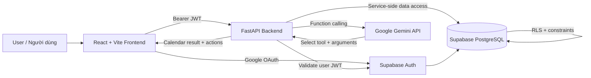
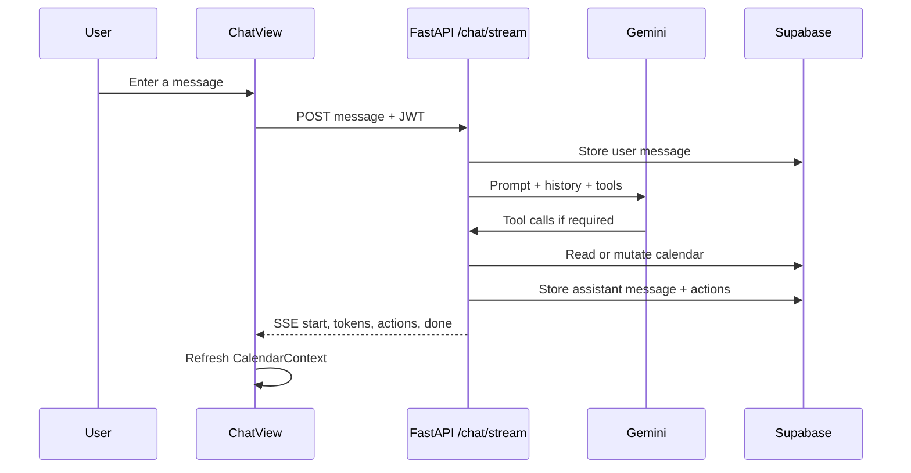

# AI Calendar Agent — Tài liệu dự án / Project Documentation

> **Tiếng Việt:** Tài liệu này mô tả toàn bộ sản phẩm AI Calendar Agent từ mục tiêu, kiến trúc tổng thể đến cách từng thành phần hoạt động, cách cài đặt, kiểm thử và phát triển tiếp.
>
> **English:** This document describes the complete AI Calendar Agent product, from its goals and high-level architecture to component behavior, setup, testing, and future development.

---

## 1. Tổng quan / Overview

### Tiếng Việt

AI Calendar Agent là ứng dụng web full-stack dành cho sinh viên và người tự học. Người dùng có thể trò chuyện bằng ngôn ngữ tự nhiên để tìm thời gian rảnh, tạo lịch học, dời hoặc xóa sự kiện, và tự động phân bổ các buổi ôn tập trước ngày thi.

Sản phẩm gồm hai trải nghiệm chính:

1. **AI Assistant:** giao diện hội thoại tối giản theo phong cách ChatGPT/Codex.
2. **Calendar:** giao diện lịch tháng, tuần, ngày và lịch biểu theo phong cách Google Calendar.

Dữ liệu được bảo vệ theo từng tài khoản bằng Supabase Auth và PostgreSQL Row Level Security. Gemini đóng vai trò bộ não suy luận, nhưng mọi thao tác thật lên lịch đều được thực hiện thông qua các function-calling tools do backend kiểm soát.

### English

AI Calendar Agent is a full-stack web application for students and self-directed learners. Users can communicate in natural language to find free time, create study schedules, move or delete events, and automatically distribute revision sessions before an exam.

The product provides two primary experiences:

1. **AI Assistant:** a minimal conversational interface inspired by ChatGPT/Codex.
2. **Calendar:** month, week, day, and agenda views inspired by Google Calendar.

Data is isolated per account with Supabase Auth and PostgreSQL Row Level Security. Gemini provides reasoning, while all real calendar mutations are executed through backend-controlled function-calling tools.

---

## 2. Mục tiêu sản phẩm / Product Goals

### Tiếng Việt

- Giảm thời gian người học phải tự tìm và sắp xếp lịch.
- Biến mục tiêu học tập thành các buổi học cụ thể trên lịch.
- Tránh tạo lịch trùng với các sự kiện đã có.
- Cho phép điều chỉnh trực tiếp bằng kéo thả hoặc bằng hội thoại.
- Đồng bộ thao tác AI và giao diện lịch trong cùng một ứng dụng.
- Bảo vệ dữ liệu cá nhân ở cả API và database.

### English

- Reduce the time learners spend manually arranging schedules.
- Turn learning goals into concrete calendar sessions.
- Prevent conflicts with existing events.
- Support direct drag-and-drop editing and conversational editing.
- Keep AI actions and the visual calendar synchronized in one application.
- Protect personal data at both API and database layers.

---

## 3. Tính năng đã xây dựng / Implemented Features

### 3.1. Xác thực / Authentication

- Đăng nhập Google qua Supabase OAuth.
- Theo dõi và tự động làm mới Supabase session.
- Backend xác minh JWT bằng Supabase Auth trước mỗi API request cần bảo vệ.
- Tự động tạo profile khi người dùng đăng ký lần đầu.
- Nút đăng xuất và hiển thị avatar Google.

### 3.2. AI Assistant

- Màn hình chào tối giản và bốn prompt gợi ý.
- Sidebar lịch sử hội thoại có thể thu gọn.
- Tạo cuộc hội thoại mới và mở lại hội thoại cũ.
- Đổi tên hoặc xóa cuộc hội thoại từ sidebar; tiêu đề mới được Gemini tạo một lần sau tin nhắn đầu tiên.
- Textarea tự tăng chiều cao và gửi bằng phím Enter.
- Dán ảnh bằng Ctrl+V hoặc chọn JPG/PNG/WebP/GIF từ máy, xem trước và xóa trước khi gửi; ảnh chỉ được chuyển inline tới Gemini và không lưu vào Supabase.
- Streaming token thật từ Gemini qua Server-Sent Events; lịch sử được gửi đúng cấu trúc role/content.
- Render Markdown trong câu trả lời AI.
- Inline action pill báo sự kiện được tạo, sửa, xóa hoặc slot rảnh được tìm thấy.
- Chuyển thẳng sang Calendar từ action pill.
- Lưu tin nhắn và metadata hành động vào Supabase.
- Chỉ lưu cặp tin nhắn sau khi stream hoàn tất và giới hạn 10 yêu cầu AI/phút/người dùng.

### 3.3. Calendar

- Chế độ tháng, tuần, ngày và lịch biểu.
- Vạch chỉ thời gian hiện tại.
- Tạo sự kiện bằng nút “Tạo mới” hoặc chọn ô thời gian trống.
- Xem và sửa sự kiện bằng modal.
- Kéo thả sự kiện để đổi thời gian.
- Resize sự kiện để đổi thời lượng.
- Xóa mềm sự kiện vào Thùng rác, khôi phục hoặc xóa vĩnh viễn.
- Lọc sự kiện theo môn học hoặc danh mục.
- Mini-calendar 7×6 có điều hướng tháng, ngày hiện tại và ngày được chọn.
- Sự kiện cả ngày và chuỗi lặp hằng ngày, hằng tuần hoặc hằng tháng.
- Hiển thị giờ, màu danh mục lấy từ dữ liệu thật, badge AI, tooltip và trạng thái hoàn thành.
- Panel Tasks ngay trong Calendar sidebar.
- Settings cho tên, múi giờ, giờ học và Pomodoro; toggle Sáng/Tối lưu lựa chọn.
- Badge trong ứng dụng đếm các sự kiện bắt đầu trong 24 giờ tới.
- URL riêng `/chat` và `/calendar` cùng tiêu đề browser tab động.

### 3.4. Lập lịch thông minh / Smart Scheduling

- Đọc lịch trong một khoảng ngày.
- Tìm các khoảng thời gian rảnh theo thời lượng yêu cầu.
- Gộp các khoảng bận giao nhau trước khi tính slot rảnh.
- Phân bổ buổi học trước ngày thi.
- Ưu tiên khung giờ buổi tối khi tự động lên kế hoạch.
- Kiểm tra xung đột ở API, AI tools và database.
- Database exclusion constraint ngăn hai sự kiện “scheduled” của cùng người dùng bị chồng thời gian.

### English Summary

The implemented product includes Google OAuth, JWT-protected APIs, persistent and manageable conversations, native Gemini streaming/tool calling, recurring and all-day events, recoverable deletion, study tasks, profile settings, light/dark themes, in-app upcoming-event badges, conflict prevention, free-slot search, and automated study-session distribution.

---

## 4. Kiến trúc hệ thống / System Architecture



### Nguyên tắc thiết kế / Design Principles

- **Decoupled full-stack:** frontend và backend là hai ứng dụng độc lập, giao tiếp qua HTTP.
- **Backend-controlled mutations:** Gemini không truy cập database trực tiếp.
- **Defense in depth:** xác minh JWT ở backend, lọc theo user ID trong query và RLS ở database.
- **Single source of truth:** Supabase PostgreSQL là nguồn dữ liệu chính cho lịch, profile, task và chat.
- **Instant application sync:** sau thao tác AI, frontend tải lại CalendarContext để phản ánh dữ liệu mới.

---

## 5. Công nghệ sử dụng / Technology Stack

| Layer | Technology | Responsibility |
|---|---|---|
| Frontend | React 19, TypeScript, Vite | UI and client-side state |
| Styling | Tailwind CSS 4 + custom CSS | Layout, responsive UI, visual system |
| Calendar | FullCalendar | Month/week/day/list views and interactions |
| HTTP | Axios + Fetch | REST calls and SSE stream consumption |
| Icons | Lucide React | Interface icons |
| Markdown | React Markdown | Assistant response rendering |
| Authentication | Supabase Auth | Google OAuth and user sessions |
| Database | Supabase PostgreSQL | Persistent application data |
| Security | PostgreSQL RLS | Per-user row isolation |
| Backend | FastAPI, Pydantic, Uvicorn | REST API, validation, orchestration |
| AI | Google Gemini, google-genai SDK | Natural-language reasoning and tool selection |
| Database client | supabase-py | Server-side Supabase access |
| Testing | Pytest, FastAPI TestClient | Backend and scheduling tests |
| Orchestration | concurrently | Start frontend and backend with one command |

---

## 6. Cấu trúc thư mục / Project Structure

```text
Calendar_Agent/
├── .gitignore
├── README.md
├── PROJECT_DOCUMENTATION.md
├── package.json                  # Root commands: dev, build, test
├── package-lock.json
├── backend/
│   ├── .env.example
│   ├── requirements.txt
│   ├── main.py                   # FastAPI app, CORS, router registration
│   ├── config.py                 # Environment configuration
│   ├── agent/
│   │   ├── gemini_agent.py       # Gemini orchestration and system prompt
│   │   ├── tools.py              # Calendar function-calling tools
│   │   └── scheduler_logic.py    # Free-slot and study-plan algorithms
│   ├── db/
│   │   ├── auth.py               # Bearer JWT validation
│   │   └── supabase_client.py    # Server-side Supabase client
│   ├── models/
│   │   ├── event.py
│   │   ├── task.py
│   │   ├── chat.py
│   │   └── profile.py
│   ├── routes/
│   │   ├── events.py
│   │   ├── tasks.py
│   │   ├── chat.py
│   │   └── profile.py
│   └── tests/
│       ├── test_health.py
│       └── test_scheduler_logic.py
├── frontend/
│   ├── .env.example
│   ├── package.json
│   ├── vite.config.ts
│   ├── tsconfig*.json
│   └── src/
│       ├── App.tsx
│       ├── main.tsx
│       ├── index.css
│       ├── api/
│       │   ├── client.ts
│       │   ├── events.ts
│       │   └── chat.ts
│       ├── components/
│       │   ├── Navbar.tsx
│       │   ├── auth/LoginView.tsx
│       │   ├── chat/
│       │   └── calendar/
│       ├── context/
│       │   ├── AuthContext.tsx
│       │   └── CalendarContext.tsx
│       ├── lib/supabase.ts
│       └── types/
└── supabase/
    ├── .env.example
    ├── config.toml
    ├── schema.sql
    └── migrations/
        └── 202608200001_initial_schema.sql
```

---

## 7. Frontend chi tiết / Frontend Details

### 7.1. Application Shell

`App.tsx` quyết định hiển thị màn hình loading, màn hình đăng nhập hoặc ứng dụng chính. Sau khi đăng nhập, người dùng chuyển đổi giữa Chat và Calendar qua Navbar.

Calendar được lazy-load để giảm kích thước JavaScript cần tải ở màn hình Chat đầu tiên.

### 7.2. AuthContext

`AuthContext.tsx`:

- Đọc session hiện tại từ Supabase.
- Lắng nghe thay đổi trạng thái đăng nhập.
- Cung cấp `signInWithGoogle()` và `signOut()`.
- Chỉ cho ứng dụng chính render khi session hợp lệ.
- Chuyển OAuth callback về origin hiện tại.

### 7.3. CalendarContext

`CalendarContext.tsx` là lớp đồng bộ dữ liệu lịch phía frontend:

- Tải danh sách events sau khi đăng nhập.
- Cung cấp `create`, `update`, `remove` và `refresh`.
- Cập nhật state local sau mỗi thao tác thành công.
- Được ChatView gọi `refresh()` sau khi AI thay đổi lịch.

### 7.4. Chat Flow



### 7.5. Calendar Flow

FullCalendar được cấu hình với:

- `dayGridMonth`
- `timeGridWeek`
- `timeGridDay`
- `listWeek`
- Drag/drop và resize qua interaction plugin.
- Selectable time cells.
- `nowIndicator` cho thời gian hiện tại.
- Khoảng hiển thị mặc định từ 06:00 đến 24:00.

### English Summary

The frontend application shell gates the product behind a valid Supabase session. AuthContext owns OAuth lifecycle, CalendarContext owns shared event state, ChatView consumes SSE events, and FullCalendar provides direct calendar manipulation. After an AI mutation, ChatView refreshes the shared calendar state so both screens remain consistent.

---

## 8. Backend chi tiết / Backend Details

### 8.1. FastAPI Entry Point

`backend/main.py`:

- Tạo FastAPI application.
- Cấu hình CORS cho frontend URL.
- Đăng ký Events, Tasks, Chat và Profile routers.
- Cung cấp `GET /health` để kiểm tra trạng thái backend và cấu hình dịch vụ.

### 8.2. Authentication Dependency

`db/auth.py` đọc Bearer token từ request và gọi Supabase Auth để xác minh user. Endpoint bảo vệ nhận `user_id` đã xác minh thay vì tin dữ liệu user ID do frontend gửi.

### 8.3. Validation

Pydantic models kiểm tra:

- Title không được trống.
- Event end time phải sau start time.
- Màu phải có dạng hexadecimal sáu ký tự.
- Task priority nằm trong khoảng 1–3.
- Pomodoro nằm trong khoảng 15–120 phút.
- Chat request không vượt quá giới hạn nội dung.

### 8.4. Conflict Protection

Xung đột được ngăn ở ba lớp:

1. **REST API:** query sự kiện giao nhau trước khi tạo hoặc sửa.
2. **AI tools:** kiểm tra trước khi Gemini tool ghi dữ liệu.
3. **PostgreSQL:** exclusion constraint là lớp bảo vệ cuối cùng.

### English Summary

FastAPI registers isolated route modules and validates all protected requests through Supabase Auth. Pydantic rejects malformed payloads before database access. Event conflict protection is intentionally repeated in REST handlers, Gemini tools, and PostgreSQL so a failure or bypass at one layer cannot silently corrupt the schedule.

---

## 9. Gemini Agent và Function Calling

### 9.1. System Prompt

Agent được hướng dẫn:

- Trả lời bằng tiếng Việt.
- Kiểm tra lịch trước khi tạo hoặc dời sự kiện.
- Không tự đoán ngày, giờ, múi giờ hoặc thời lượng quan trọng.
- Hỏi lại khi yêu cầu thiếu thông tin.
- Chỉ thay đổi lịch khi người dùng yêu cầu rõ ràng.
- Trả lời ngắn gọn và thân thiện.

In English, the agent is instructed to respond in Vietnamese, inspect the current schedule before mutations, avoid guessing important time details, ask for clarification when required, perform only explicitly requested changes, and keep responses concise.

### 9.2. Tools

| Tool | Purpose |
|---|---|
| `get_current_schedule(start_date, end_date)` | Read events in a date range |
| `create_calendar_event(...)` | Create one event |
| `create_calendar_events(events)` | Create multiple events, such as a pasted timetable |
| `reschedule_event(event_id, new_start, new_end)` | Move an event |
| `delete_calendar_event(event_id)` | Delete an event |
| `find_free_time_slots(target_date, duration_minutes)` | Find available time slots |
| `auto_plan_study_sessions(subject, exam_date, total_hours, session_duration)` | Distribute study sessions before an exam |

### 9.3. Scheduler Algorithm

`scheduler_logic.py`:

1. Chuyển sự kiện sang timezone người dùng.
2. Giới hạn tìm kiếm trong thời gian hoạt động mặc định 07:00–22:00.
3. Sắp xếp và gộp các khoảng bận giao nhau.
4. Duyệt khoảng trống theo bước 30 phút.
5. Chỉ trả về slot đủ dài.
6. Khi tự lập kế hoạch, phân phối tối đa một session phù hợp mỗi ngày cho đến ngày thi hoặc đủ tổng thời lượng.

The scheduling engine normalizes events to the user's timezone, merges overlapping busy intervals, scans available time in 30-minute increments, and distributes suitable study sessions across the days before an exam.

---

## 10. Database Schema

### 10.1. profiles

| Column | Type | Description |
|---|---|---|
| `id` | uuid | Same ID as `auth.users.id` |
| `display_name` | text | User display name |
| `timezone` | text | Default: Asia/Ho_Chi_Minh |
| `day_start` | time | Preferred day start |
| `day_end` | time | Preferred day end |
| `pomodoro_minutes` | integer | Preferred focus duration |
| `created_at` | timestamptz | Creation timestamp |
| `updated_at` | timestamptz | Last update timestamp |

A trigger automatically inserts a profile after a new Supabase Auth user is created.

### 10.2. events

Stores title, description, start/end timestamps, color, category, status, AI-generated flag, `all_day`, recurrence frequency/end date, `deleted_at`, and audit timestamps.

Important constraints:

- End must be after start.
- Color must be a valid six-digit hex value.
- Status must be `scheduled`, `completed`, or `cancelled`.
- Recurrence must be `daily`, `weekly`, or `monthly` and requires an inclusive end date.
- Active scheduled base events belonging to the same user cannot overlap; the API also checks expanded recurring instances.

### 10.3. study_tasks

Stores study goals with subject, estimated hours, deadline, priority, and status.

### 10.4. conversations

Stores a user-owned conversation title and creation/update timestamps. Deleting a conversation cascades to its messages.

### 10.5. chat_messages

Stores messages with user ID, conversation ID, role, content, JSON metadata, and creation timestamp. Calendar actions are stored in `metadata.actions`.

### 10.6. Indexes

Indexes cover:

- User ownership columns used by RLS.
- Event time range queries.
- Event categories.
- Task deadlines.
- Conversation history ordered by creation time.

---

## 11. Row Level Security

RLS is enabled on all application tables.

Each table has explicit policies for `SELECT`, `INSERT`, `UPDATE`, and `DELETE`. Policies are scoped to the `authenticated` role and compare `auth.uid()` with the row owner.

```text
profiles.id          = auth.uid()
events.user_id       = auth.uid()
study_tasks.user_id  = auth.uid()
conversations.user_id = auth.uid()
chat_messages.user_id = auth.uid()
```

Unauthenticated users cannot read or modify application rows. Backend secret credentials remain server-only and are never included in the frontend bundle.

---

## 12. API Endpoints

All `/api/*` endpoints require a valid Supabase user JWT unless stated otherwise.

| Method | Endpoint | Description |
|---|---|---|
| GET | `/health` | Health and configuration status |
| GET | `/api/events` | List user events |
| POST | `/api/events` | Create an event |
| PATCH | `/api/events/{event_id}` | Update an event |
| DELETE | `/api/events/{event_id}` | Move an event to Trash |
| GET | `/api/events/trash` | List deleted events |
| POST | `/api/events/{event_id}/restore` | Restore an event |
| DELETE | `/api/events/{event_id}/permanent` | Permanently delete a trashed event |
| GET | `/api/tasks` | List study tasks |
| POST | `/api/tasks` | Create a study task |
| PATCH | `/api/tasks/{task_id}` | Update a study task |
| DELETE | `/api/tasks/{task_id}` | Delete a study task |
| GET | `/api/profile` | Get user profile |
| PATCH | `/api/profile` | Create or update profile |
| GET | `/api/chat/conversations` | List conversations |
| GET | `/api/chat/conversations/{id}` | Load conversation messages |
| PATCH | `/api/chat/conversations/{id}` | Rename a conversation |
| DELETE | `/api/chat/conversations/{id}` | Delete a conversation and its messages |
| POST | `/api/chat` | Send a regular chat request |
| POST | `/api/chat/stream` | Send a chat request and receive SSE events |

### SSE Event Types

- `start`: contains the conversation ID.
- `token`: contains a text fragment.
- `actions`: contains calendar action metadata.
- `error`: contains a safe user-facing Gemini/API error.
- `done`: marks the end of the stream.

---

## 13. Biến môi trường / Environment Variables

### backend/.env

| Variable | Required | Purpose |
|---|---|---|
| `APP_ENV` | Yes | Runtime environment |
| `FRONTEND_URL` | Yes | Allowed CORS origin |
| `SUPABASE_URL` | Yes | Supabase project API URL |
| `SUPABASE_PUBLISHABLE_KEY` | Yes | Public project key used for auth context |
| `SUPABASE_SERVICE_ROLE_KEY` | Yes | Server-only Supabase secret key |
| `GEMINI_API_KEY` | Yes | Gemini API access |
| `GEMINI_MODEL` | Yes | Gemini model name |
| `DEFAULT_TIMEZONE` | Yes | Scheduling timezone |

### frontend/.env

| Variable | Required | Purpose |
|---|---|---|
| `VITE_API_URL` | Yes | FastAPI base URL |
| `VITE_SUPABASE_URL` | Yes | Supabase project URL |
| `VITE_SUPABASE_PUBLISHABLE_KEY` | Yes | Browser-safe publishable key |

### supabase/.env

| Variable | Required for deployment | Purpose |
|---|---|---|
| `SUPABASE_ACCESS_TOKEN` | Yes | Supabase Management/CLI access |
| `SUPABASE_DB_PASSWORD` | Yes | Remote database migration |
| `GOOGLE_OAUTH_CLIENT_ID` | Local provider config | Google OAuth client |
| `GOOGLE_OAUTH_CLIENT_SECRET` | Local provider config | Google OAuth secret |

Never commit any real value from these files. Only `.env.example` files with empty placeholders belong in Git.

---

## 14. Cài đặt và chạy / Setup and Run

### 14.1. Requirements

- Node.js and npm.
- Python 3.11 or newer.
- A Supabase project.
- A Gemini API key.
- A Google OAuth Web Client.

### 14.2. First-time Installation

```powershell
cd D:\Calendar_Agent

cd backend
python -m venv .venv
.\.venv\Scripts\Activate.ps1
pip install -r requirements.txt
Copy-Item .env.example .env

cd ..\frontend
npm install
Copy-Item .env.example .env

cd ..
npm install
```

Fill all required values in the three local `.env` files.

### 14.3. Start Everything with One Command

```powershell
cd D:\Calendar_Agent
npm run dev
```

Services:

- Frontend: `http://localhost:5173`
- Backend: `http://localhost:8000`
- API docs: `http://localhost:8000/docs`

Press `Ctrl+C` to stop both services.

The frontend uses `strictPort`; it stops with an error instead of silently switching away from port 5173 because Google OAuth redirects are configured for that port.

### 14.4. Root Commands

| Command | Purpose |
|---|---|
| `npm run dev` | Start frontend and backend together |
| `npm test` | Run backend tests |
| `npm run build` | Type-check and build the frontend |

---

## 15. Supabase Deployment

```powershell
$values = Get-Content supabase/.env | ConvertFrom-StringData
$env:SUPABASE_ACCESS_TOKEN = $values.SUPABASE_ACCESS_TOKEN
$env:SUPABASE_DB_PASSWORD = $values.SUPABASE_DB_PASSWORD

npx --yes supabase@latest link --project-ref <project-ref>
npx --yes supabase@latest db push --dry-run
npx --yes supabase@latest db push
```

Always run `--dry-run` first. The migration history prevents already-applied migrations from being executed again.

### Google OAuth Configuration

The Google OAuth Web Client must include:

- Authorized JavaScript origin: `http://localhost:5173`
- Authorized redirect URI: `https://<project-ref>.supabase.co/auth/v1/callback`

Supabase Auth must have Google enabled, the same Client ID/Secret, Site URL `http://localhost:5173`, and the local redirect allow list.

---

## 16. Kiểm thử đã thực hiện / Testing Performed

### Automated Tests

- FastAPI health endpoint.
- Free-slot calculation avoids busy events.
- Returned slot duration matches the request.
- Daily/monthly recurrence expansion and recurring conflict detection.
- Sliding-window rate limiting.
- Frontend TypeScript compilation.
- Vite production build.

Current backend result:

```text
10 passed
```

### Live Integration Tests

The implementation was also validated against the hosted Supabase and Gemini services:

- Supabase publishable and secret keys validated.
- Gemini API key and model access validated.
- Migration dry-run and real migration succeeded.
- Remote migration state confirmed up to date.
- Google provider enabled.
- Google consent endpoint accepted the callback URI.
- Temporary Auth user created and removed.
- Profile trigger created the matching profile.
- Authenticated event CRUD succeeded.
- Anonymous RLS query returned no private rows.
- Overlapping event insertion was blocked with PostgreSQL code `23P01`.
- FastAPI health confirmed Supabase and Gemini configuration.
- FastAPI event create/list/delete succeeded using a real user JWT.
- Recurrence conflict, soft-delete, Trash restore/permanent delete, task CRUD, and profile preferences passed through the live API.
- Native Gemini SSE streaming, generated conversation title, rename, and delete passed through the live API.
- Multimodal image streaming passed with an inline PNG; the persisted message contained only `image_count`, not image bytes.
- All temporary test users and events were deleted after validation.
- Root `npm run dev` started both services successfully.
- Frontend returned HTTP 200 on port 5173.
- Backend health returned `ok` on port 8000.

---

## 17. Bảo mật / Security

- Real secrets are stored only in ignored `.env` files.
- Secret scanning was performed before commits.
- Supabase secret key is backend-only.
- Frontend uses only the publishable key.
- JWTs are validated server-side.
- Every protected query is scoped to the authenticated user.
- RLS provides database-level isolation.
- Database constraints protect data integrity even if application validation is bypassed.
- Security-definer Auth trigger uses an empty search path and schema-qualified table names.
- CORS is restricted to the configured frontend origin.
- API responses never return server credentials.

---

## 18. Git History / Implementation History

| Commit | Description |
|---|---|
| `52fc695` | Initial full-stack AI Calendar Agent foundation |
| `62804a6` | Supabase schema, migration, RLS, and Google Auth configuration |
| `ce50932` | One-command frontend/backend development workflow |
| `f167eb0` | Complete bilingual project documentation |

The main branch tracks:

`https://github.com/chinmt22225-ops/Calendar_Agent.git`

---

## 19. Trạng thái hiện tại / Current Status

### Hoàn thành / Completed

- Full-stack project structure.
- Google OAuth through Supabase.
- Database schema, migration, triggers, indexes, constraints, and RLS.
- Events, tasks, profile, and chat APIs.
- Gemini function calling.
- Smart scheduling and conflict prevention.
- Minimal chat interface.
- Interactive calendar interface.
- Recurrence, all-day events, Tasks, Trash, event completion and in-app badge.
- Settings, profile-aware scheduling, persistent light/dark theme and URL routing.
- Native Gemini streaming, rate limiting, generated titles and conversation management.
- One-command local development.
- Backend tests and production frontend build.
- Live Supabase/Gemini integration validation.
- GitHub synchronization.

### Hạn chế hiện tại / Current Limitations

- The calendar is Google Calendar-inspired but does **not** synchronize with the external Google Calendar API.
- The mobile layout hides the Calendar sidebar and does not yet provide a dedicated mobile filter drawer.
- Automated frontend component and end-to-end browser tests are not yet included.
- The root development command currently targets Windows virtual-environment paths.
- Production hosting, custom domains, production OAuth origins, CI/CD, monitoring, and backups are not configured.
- The application intentionally uses an in-app upcoming-event badge; browser push/email reminders are not included.

---

## 20. Hướng phát triển / Roadmap

### Near Term

- Add conversation search.
- Add frontend component tests and Playwright end-to-end tests.
- Add a mobile Calendar filter drawer.
- Add retry actions to existing user-facing error toasts.
- Add production deployment configuration and CI checks.

### Medium Term

- Add per-occurrence exceptions for recurring series.
- Optionally add study reminders beyond the current in-app badge.
- Add analytics for study hours, completion, and subject balance.
- Add configurable working hours and preferred study windows to scheduling logic.
- Add approval/preview mode before AI applies multiple calendar changes.
- Add export/import support such as ICS.

### Optional Integrations

- External Google Calendar API synchronization.
- Email reminders.
- Calendar sharing and collaborative planning.
- Mobile or progressive web application support.

---

## 21. Ghi chú cho người bảo trì / Maintainer Notes

### Tiếng Việt

Khi thay đổi database:

1. Tạo migration mới, không chỉnh sửa migration đã chạy trên production.
2. Chạy `db push --dry-run`.
3. Kiểm tra RLS cho mọi bảng hoặc cột mới.
4. Chạy test và kiểm tra không có secrets trong Git diff.
5. Cập nhật tài liệu này nếu kiến trúc hoặc hành vi sản phẩm thay đổi.

Khi thêm Gemini tool:

1. Dùng type hints rõ ràng.
2. Viết docstring mô tả đầy đủ tham số.
3. Xác minh tool schema bằng google-genai SDK.
4. Kiểm tra quyền sở hữu dữ liệu trong tool implementation.
5. Ghi lại calendar action để frontend hiển thị phản hồi inline.
6. Thêm test cho logic thuần trước khi kết nối database.

### English

When changing the database:

1. Create a new migration; do not modify an already-applied production migration.
2. Run `db push --dry-run`.
3. Review RLS for every new table or column.
4. Run tests and verify that no secrets appear in the Git diff.
5. Update this document when architecture or product behavior changes.

When adding a Gemini tool:

1. Use explicit type hints.
2. Write complete parameter documentation.
3. Validate the generated tool schema with the google-genai SDK.
4. Enforce data ownership inside the tool implementation.
5. Record calendar actions for inline frontend feedback.
6. Test pure logic before integrating database operations.

---

## 22. Quick Reference

```powershell
# Start the complete application
cd D:\Calendar_Agent
npm run dev

# Run tests
npm test

# Build frontend
npm run build

# Check backend health
Invoke-RestMethod http://localhost:8000/health
```

### Local URLs

- Application: `http://localhost:5173`
- Backend: `http://localhost:8000`
- OpenAPI documentation: `http://localhost:8000/docs`
- Health check: `http://localhost:8000/health`

---

**Repository:** https://github.com/chinmt22225-ops/Calendar_Agent

**Document purpose:** Give users, contributors, reviewers, and maintainers a complete understanding of what was built, how it works, how to run it, and what remains for future development.
