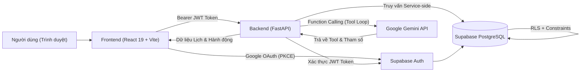

# AI Calendar Agent — Tài liệu Kỹ thuật Dự án Toàn diện

> **Tài liệu này mô tả toàn diện hệ thống AI Calendar Agent (Planora): từ mục tiêu sản phẩm, kiến trúc kỹ thuật, cơ sở dữ liệu, danh mục API, AI Agent điều phối, đến quy trình cài đặt, kiểm thử, bảo mật và hướng dẫn bảo trì dự án.**

---

## 1. Tổng quan Sản phẩm

**AI Calendar Agent (Planora)** là ứng dụng web full-stack thông minh được thiết kế chuyên biệt cho sinh viên, học sinh và người tự học. Người dùng có thể trò chuyện tự nhiên bằng tiếng Việt hoặc tiếng Anh để tìm kiếm thời gian rảnh, tạo lịch học, dời hoặc xóa sự kiện, tải lên ảnh thời khóa biểu để AI tự động phân tích và phân bổ các buổi ôn tập trước kỳ thi.

Sản phẩm kết hợp mượt mà giữa hai trải nghiệm cốt lõi:

1. **Trợ lý AI (AI Assistant):** Giao diện hội thoại tối giản, hiện đại theo phong cách ChatGPT/Codex với khả năng hiểu ngữ cảnh đa phương thức (văn bản và hình ảnh thời khóa biểu), streaming phản hồi theo thời gian thực (SSE) và gọi công cụ (Function Calling) nhiều bước có kiểm soát.
2. **Lịch biểu Trực quan (Interactive Calendar):** Giao diện lịch học chuẩn Google Calendar với các chế độ xem linh hoạt (Tháng, Tuần, Ngày, Lịch biểu), trục thời gian 24 giờ hoàn chỉnh, vạch theo dõi thời gian thực (*Current Time Indicator*), kéo thả (*Drag & Drop*) và thay đổi thời lượng (*Resize*) mượt mà, hệ thống thông báo đẩy màn hình hệ điều hành qua Service Worker ngầm và hiệu ứng Spotlight hào quang phát sáng.

Dữ liệu của từng người dùng được bảo vệ và cô lập độc lập 100% bằng **Supabase Auth** và **PostgreSQL Row Level Security (RLS)**. Mô hình ngôn ngữ lớn **Google Gemini** đóng vai trò bộ não tư duy và phân tích, trong khi toàn bộ thao tác ghi dữ liệu vào cơ sở dữ liệu đều được kiểm soát nghiêm ngặt bởi backend FastAPI thông qua danh sách công cụ được cấp phép.

---

## 2. Mục tiêu Sản phẩm

- **Tiết kiệm thời gian lập kế hoạch:** Giảm thiểu tối đa thời gian người học phải tự dò tìm khoảng trống và sắp xếp thời khóa biểu thủ công.
- **Biến mục tiêu học tập thành hành động:** Chuyển đổi các mục tiêu ôn thi lớn thành các buổi học cụ thể, vừa sức phân bổ đều đặn trên lịch biểu.
- **Ngăn ngừa xung đột lịch 100%:** Kiểm tra và loại trừ mọi nguy cơ trùng giờ ở 3 lớp (API, AI Tools, Database Exclusion Constraints).
- **Trải nghiệm thao tác kép linh hoạt:** Cho phép người dùng linh hoạt điều chỉnh lịch trực tiếp bằng kéo thả chuột trên màn hình hoặc trò chuyện qua trợ lý AI.
- **Đồng bộ hóa tức thời:** Mọi thay đổi từ AI hoặc giao diện Lịch đều được cập nhật thời gian thực trên cùng một ứng dụng mà không cần tải lại trang.
- **Bảo mật và riêng tư tuyệt đối:** Dữ liệu cá nhân, thời khóa biểu và đoạn chat được cô lập hoàn toàn giữa các người dùng ở cả tầng API và Database.

---

## 3. Các Tính năng Đã Xây dựng

### 3.1. Xác thực & Quản lý Tài khoản (Authentication)

- Đăng nhập an toàn 1-chạm bằng tài khoản Google thông qua **Supabase OAuth (PKCE Flow)**.
- Tự động duy trì và làm mới phiên đăng nhập (JWT refresh) an toàn.
- Backend FastAPI xác thực chữ ký điện tử của Bearer JWT trên từng yêu cầu API cần bảo vệ.
- Tự động khởi tạo hồ sơ học tập (`profiles`) mặc định ngay khi người dùng đăng ký lần đầu qua Database Trigger.
- Xem thông tin tài khoản, avatar Google, tên hiển thị và nút Đăng xuất an toàn.

### 3.2. Trợ lý Lập kế hoạch AI (AI Assistant)

- Màn hình chào thân thiện kèm các thẻ gợi ý câu lệnh mẫu hữu ích.
- Thanh bên (Sidebar) quản lý lịch sử các cuộc hội thoại, hỗ trợ thu gọn mượt mà.
- Tạo hội thoại mới, đổi tên hoặc xóa hội thoại; tiêu đề ban đầu được AI tóm tắt ngắn gọn tự động.
- Khung nhập liệu thông minh: tự động co giãn chiều cao theo nội dung, gửi tin nhắn bằng phím `Enter`, xuống dòng bằng `Shift + Enter`.
- **Hỗ trợ hình ảnh đa phương thức:** Dán ảnh trực tiếp bằng `Ctrl + V` hoặc chọn file ảnh từ máy (JPG, PNG, WebP, GIF), xem trước và xóa ảnh trước khi gửi; ảnh được xử lý inline gửi trực tiếp tới Gemini để trích xuất thời khóa biểu mà không lưu rác vào database.
- **Truyền luồng phản hồi thời gian thực (Server-Sent Events - SSE):** Người dùng nhìn thấy từng từ AI phản hồi xuất hiện tức thì với độ trễ cực thấp.
- **Vòng lặp Function Calling có kiểm soát:** Backend tự động điều phối tối đa 8 vòng gọi công cụ (đọc lịch, tạo lịch, sửa/xóa, tìm giờ trống, tạo task), kiểm duyệt tham số và chỉ thực thi các hàm trong danh sách cho phép trước khi trả lời người dùng.
- **Hiển thị thẻ hành động trực quan (Action Pills):** Báo cáo chi tiết các sự kiện/nhiệm vụ vừa được AI tạo, sửa, dời hoặc xóa, kèm nút bấm 1-chạm chuyển thẳng sang Lịch để xem ngay.
- Trình biên dịch Markdown cao cấp: hỗ trợ định dạng văn bản, danh sách, bảng biểu và khối code rõ ràng.
- Ghi nhận hội thoại nguyên tử thông qua Database Transaction/RPC.
- **Kiểm soát giới hạn tần suất (Rate Limiting):** Giới hạn tối đa 10 yêu cầu AI/phút/người dùng được đồng bộ giữa các worker backend qua PostgreSQL.

### 3.3. Lịch biểu Trực quan & Hệ thống Thông báo (Calendar & Notifications)

- **4 Chế độ xem linh hoạt (Schedule-X):** Tháng (Month Grid), Tuần (Week), Ngày (Day), và Lịch biểu (Month Agenda).
- **Trục tung thời gian 24 giờ liên tục (00:00 – 24:00):** Mở rộng trọn vẹn 24 giờ trong ngày với chiều cao lưới thoáng đãng (1680px, ~70px/giờ), tự động cuộn nhẹ đến vùng giờ học ban ngày (~07:00 – 08:00 sáng) khi khởi động.
- **Vạch theo dõi thời gian thực (Real-time Current Time Indicator):** Vạch đỏ hồng thanh mảnh kèm chấm tròn phát sáng đa tầng ở trục giờ, tự động cập nhật vị trí từng phút theo múi giờ `Asia/Ho_Chi_Minh` chuẩn Google Calendar.
- **Kéo – Thả & Thay đổi thời lượng siêu mượt:** Di chuyển sự kiện xuyên suốt tất cả các ngày trong tuần mà không bị cắt viền (`overflow: visible`), bước nhảy 15 phút (*15-minute snap*), thẻ mờ đối chiếu vị trí gốc (*Ghost Card*) và tay nắm kéo giãn cạnh đáy tiện dụng.
- **Hệ thống thông báo đẩy Desktop (OS-level Notification qua Service Worker `sw.js`):**
  - Bắn pop-up thông báo hệ điều hành (Windows / macOS / Android) trước giờ học/sự kiện ngay cả khi người dùng đang lướt tab web khác hoặc thu nhỏ trình duyệt.
  - Âm thanh chuông báo tinh tế được tổng hợp bằng Web Audio API.
  - Cơ chế **Click-to-Focus 1-chạm**: Click vào thông báo từ bất kỳ đâu sẽ tự động đưa tab Planora lên trước màn hình, chuyển thẳng vào trang Lịch và trỏ đến sự kiện.
- **Tính năng Bật/Tắt & Tùy chỉnh Thông báo Toàn diện:**
  - Nút bật/tắt nhanh thông báo sự kiện trực tiếp ngay trên menu Chuông (Navbar) với biểu tượng `BellOff` khi tắt.
  - Mục **Cài đặt Thông báo & Nhắc nhở** trong Settings Modal: Công tắc Bật/Tắt nhắc nhở sự kiện, Công tắc Bật/Tắt âm thanh chuông báo, và Danh sách chọn thời gian nhắc trước (5, 10, 15, 30 phút). Lựa chọn được lưu bền vững trên trình duyệt qua `localStorage`.
- **Hiệu ứng Spotlight phát sáng đa tầng (Direct DOM Pulse & Glow):** Làm nổi bật sự kiện trong 2.8 giây khi chuyển từ thông báo mà không kích hoạt render lại Schedule-X (Zero Re-render), loại bỏ hoàn toàn hiện tượng chớp/load lại.
- **Menu chọn chế độ xem nâng cao (`z-index: 100`):** Hiển thị đè lên toàn bộ thanh tiêu đề ngày sticky một cách liền mạch, bo góc 12px chuẩn thiết kế hiện đại.
- **Quản lý sự kiện toàn diện:** Tạo sự kiện mới nhanh bằng nút bấm hoặc kéo chọn vùng thời gian trống trên lịch, xem chi tiết và chỉnh sửa bằng Modal trực quan.
- **Xóa an toàn & Thùng rác (Trash Panel):** Xóa mềm sự kiện vào Thùng rác, cho phép khôi phục lại lịch cũ bất cứ lúc nào hoặc xóa vĩnh viễn.
- **Lọc thông minh theo môn học/danh mục:** Bật/tắt hiển thị lịch theo từng môn học với bảng màu riêng biệt.
- **Mini-Calendar 7×6:** Lịch thu nhỏ ở thanh bên hỗ trợ điều hướng nhanh theo tháng, đánh dấu ngày hôm nay và ngày đang chọn.
- **Sự kiện cả ngày & Sự kiện lặp lại (Recurrence):** Hỗ trợ sự kiện cả ngày và chuỗi lặp lại định kỳ hằng ngày, hằng tuần, hằng tháng có ngày kết thúc.
- **Bảng Quản lý Nhiệm vụ (Tasks Panel):** Quản lý deadline và bài tập cần làm ngay trong thanh bên của Lịch.
- **Huy hiệu thông báo 24 giờ:** Hiển thị số lượng sự kiện sắp diễn ra trong vòng 24 giờ tới trên biểu tượng Chuông.

### 3.4. Thuật toán Lập lịch Thông minh (Smart Scheduling)

- Đọc và quét toàn bộ lịch trình hiện có của người dùng trong khoảng thời gian chỉ định.
- Thuật toán tìm khoảng trống (*Free-slot Finder*): Tự động gộp các khoảng thời gian bận giao nhau, quét và trả về danh sách các khung giờ rảnh phù hợp với độ dài yêu cầu.
- Thuật toán phân bổ lịch ôn tập (*Study Session Distribution*): Tự động tính toán tổng số giờ cần học cho một môn, phân bổ đều đặn mỗi ngày một buổi học hợp lý trước ngày thi, ưu tiên khung giờ học buổi tối theo cài đặt cá nhân của người dùng.
- Kiểm tra xung đột 3 tầng: Đảm bảo không bao giờ xếp lịch trùng vào khung giờ người dùng đã có hẹn.

---

## 4. Kiến trúc Hệ thống



### Các Nguyên tắc Thiết kế Cốt lõi

- **Kiến trúc Decoupled Full-Stack:** Frontend và Backend hoàn toàn độc lập, giao tiếp với nhau qua chuẩn REST API và Server-Sent Events (SSE).
- **Backend-controlled Mutations:** Mô hình AI Gemini không bao giờ có quyền kết nối trực tiếp vào cơ sở dữ liệu; mọi thao tác ghi/đọc dữ liệu đều phải qua các hàm kiểm soát nghiệp vụ tại backend.
- **Bảo mật đa tầng (Defense in Depth):** Xác thực JWT ở tầng Gateway/Route, lọc `user_id` bắt buộc ở tầng Application Logic, và áp dụng Row Level Security (RLS) ở tầng Database.
- **Nguồn chân lý duy nhất (Single Source of Truth):** PostgreSQL trên Supabase là nguồn dữ liệu chuẩn xác duy nhất cho lịch, hồ sơ, nhiệm vụ và hội thoại.
- **Đồng bộ hóa trạng thái tức thời:** Sau mỗi thao tác tạo/sửa lịch từ AI, frontend lập tức kích hoạt làm mới `CalendarContext` để phản ánh dữ liệu mới lên màn hình ngay lập tức.

---

## 5. Công nghệ Sử dụng

| Tầng hệ thống | Công nghệ | Vai trò & Trách nhiệm |
|---|---|---|
| **Frontend** | React 19, TypeScript, Vite | Giao diện người dùng và quản lý trạng thái client |
| **Giao diện & CSS** | Tailwind CSS 4 + Custom CSS Design System | Bố cục responsive, hệ thống biến màu sắc, dark/light theme |
| **Thư viện Lịch** | Schedule-X, @schedule-x/current-time | Hiển thị lưới lịch 24h, vạch thời gian thực, kéo thả & resize |
| **Giao tiếp HTTP** | Axios, Fetch API | Giao tiếp REST API và lắng nghe luồng sự kiện SSE |
| **Biểu tượng** | Lucide React | Hệ thống icon hiện đại, trực quan |
| **Render Nội dung** | React Markdown | Hiển thị câu trả lời của AI có định dạng bảng, chữ đậm, code |
| **Xác thực** | Supabase Auth (Google OAuth) | Quản lý phiên đăng nhập và bảo mật người dùng |
| **Cơ sở dữ liệu** | Supabase PostgreSQL | Lưu trữ dữ liệu quan hệ, bảng lịch, nhiệm vụ, tin nhắn |
| **Bảo mật Database** | PostgreSQL Row Level Security (RLS) | Cách ly và bảo vệ dữ liệu độc lập giữa từng tài khoản |
| **Backend** | FastAPI, Pydantic, Uvicorn (Python 3.11+) | Xử lý API RESTful, kiểm duyệt dữ liệu, điều phối AI |
| **Trí tuệ Nhân tạo** | Google Gemini (google-genai SDK) | Xử lý ngôn ngữ tự nhiên, phân tích ảnh và Function Calling |
| **Kiểm thử** | Pytest, Vitest, Testing Library | Bộ kiểm thử tự động toàn diện cho cả Backend và Frontend |
| **Điều phối chạy Local** | concurrently | Khởi động đồng thời cả frontend và backend chỉ với 1 câu lệnh |

---

## 6. Cấu trúc Thư mục Dự án

```text
Calendar_Agent/
├── .gitignore
├── README.md                     # Tài liệu tóm tắt dự án
├── PROJECT_DOCUMENTATION.md      # Tài liệu kỹ thuật chi tiết toàn diện
├── package.json                  # Lệnh điều phối root: dev, test, build
├── package-lock.json
├── backend/                      # Backend FastAPI (Python)
│   ├── .env.example              # Mẫu cấu hình môi trường backend
│   ├── requirements.txt          # Danh sách thư viện Python
│   ├── main.py                   # Điểm khởi động FastAPI, cấu hình CORS & Routers
│   ├── config.py                 # Đọc và xác thực biến môi trường
│   ├── agent/
│   │   ├── gemini_agent.py       # Điều phối Gemini, system prompt & SSE stream
│   │   ├── tools.py              # Định nghĩa các hàm Function Calling cho AI
│   │   └── scheduler_logic.py    # Thuật toán tìm giờ trống và phân bổ lịch ôn thi
│   ├── db/
│   │   ├── auth.py               # Middleware xác thực Bearer JWT từ Supabase
│   │   └── supabase_client.py    # Khởi tạo Supabase client tầng server
│   ├── models/                   # Pydantic schemas kiểm duyệt dữ liệu vào/ra
│   │   ├── event.py
│   │   ├── task.py
│   │   ├── chat.py
│   │   └── profile.py
│   ├── routes/                   # Các API endpoints
│   │   ├── events.py
│   │   ├── tasks.py
│   │   ├── chat.py
│   │   └── profile.py
│   └── tests/                    # Bộ kiểm thử tự động backend
│       ├── test_health.py
│       └── test_scheduler_logic.py
├── frontend/                     # Frontend React + TypeScript (Vite)
│   ├── public/
│   │   ├── sw.js                 # Service Worker xử lý thông báo đẩy Desktop chạy ngầm
│   │   └── favicon.svg
│   ├── src/
│   │   ├── App.tsx               # Điều hướng chính và quản lý shell ứng dụng
│   │   ├── main.tsx              # Điểm gắn kết React DOM
│   │   ├── styles/
│   │   │   └── redesign.css      # CSS tùy biến cao cấp cho Planora
│   │   ├── api/                  # Tầng gọi API backend
│   │   │   ├── client.ts
│   │   │   ├── events.ts
│   │   │   └── chat.ts
│   │   ├── components/
│   │   │   ├── Navbar.tsx        # Thanh điều hướng, menu chuông, chuyển theme
│   │   │   ├── SettingsModal.tsx # Hộp thoại Cài đặt (Giao diện, Thông báo, Hồ sơ)
│   │   │   ├── auth/LoginView.tsx
│   │   │   ├── chat/             # Các component màn hình Chat AI
│   │   │   └── calendar/         # Các component màn hình Lịch (Schedule-X wrapper)
│   │   ├── context/              # React Contexts quản lý trạng thái toàn cục
│   │   │   ├── AuthContext.tsx
│   │   │   ├── CalendarContext.tsx
│   │   │   ├── NotificationContext.tsx # Quản lý thông báo đẩy & Service Worker
│   │   │   ├── ProfileContext.tsx
│   │   │   ├── ThemeContext.tsx
│   │   │   └── ToastContext.tsx
│   │   ├── lib/                  # Tiện ích chuyển đổi dữ liệu và tính toán
│   │   │   ├── dates.ts
│   │   │   ├── recurrence.ts
│   │   │   ├── scheduleXAdapter.ts
│   │   │   └── supabase.ts
│   │   └── types/                # Định nghĩa TypeScript Types
└── supabase/
    ├── .env.example
    ├── config.toml
    ├── schema.sql                # Toàn bộ cấu trúc Database, RLS, Indexes & Triggers
    └── migrations/               # Lịch sử các file migration theo thời gian
```

---

## 7. Chi tiết Kiến trúc Frontend

### 7.1. Shell Ứng dụng (`App.tsx`)

`App.tsx` chịu trách nhiệm kiểm tra trạng thái xác thực từ `AuthContext`:
- Nếu chưa đăng nhập: Hiển thị màn hình giới thiệu và nút Đăng nhập Google (`LoginView`).
- Nếu đã đăng nhập: Hiển thị thanh điều hướng `Navbar` và giữ đồng thời cả 2 view `ChatView` và `CalendarView` trong DOM (sử dụng cơ chế `visibility: visible / hidden` để chuyển tab tức thì với độ trễ bằng 0, không bị mất trạng thái khi qua lại).

### 7.2. Quản lý Xác thực (`AuthContext.tsx`)

- Khởi tạo kết nối với Supabase Auth, kiểm tra session hiện tại trong trình duyệt.
- Cung cấp các hàm `signInWithGoogle()` và `signOut()`.
- Tự động đăng ký lắng nghe sự kiện `onAuthStateChange` để cập nhật trạng thái session khi token được làm mới.

### 7.3. Đồng bộ Dữ liệu Lịch (`CalendarContext.tsx`)

- Quản lý danh sách sự kiện (`events`), danh mục môn học (`categories`), màu sắc (`categoryColors`).
- Cung cấp các hàm thao tác dữ liệu: `create`, `update`, `remove`, `refresh`.
- Quản lý mục tiêu tiêu điểm (`focusTarget: { eventId, date }`), cung cấp hàm `focusEvent(eventId, date)` giúp điều hướng thẳng đến sự kiện khi người dùng click vào thông báo hoặc danh sách sự kiện sắp tới.

### 7.4. Hệ thống Thông báo & Service Worker (`NotificationContext.tsx`)

- Đăng ký tiến trình chạy ngầm **Service Worker (`/sw.js`)** cho trình duyệt.
- Quản lý trạng thái cài đặt thông báo:
  - `enabled`: Bật / Tắt nhắc nhở (lưu trong `localStorage`).
  - `soundEnabled`: Bật / Tắt âm thanh chuông báo.
  - `leadTimeMinutes`: Thời gian nhắc trước (5, 10, 15, 30 phút).
- Tiến trình quét định kỳ 30 giây: Tự động kiểm tra các sự kiện sắp diễn ra trong khoảng thời gian chỉ định, phát âm thanh chuông báo và kích hoạt thông báo đẩy hệ thống của Windows/macOS.
- Khi người dùng click vào thông báo từ bất kỳ đâu, Service Worker gửi tin nhắn `PLANORA_NOTIFICATION_CLICK`, ứng dụng tự động focus tab, chuyển vào trang Lịch và kích hoạt hiệu ứng Spotlight làm sáng sự kiện.

---

## 8. Chi tiết Kiến trúc Backend (FastAPI)

### 8.1. Cấu hình & Khởi tạo (`backend/main.py`)

- Khởi tạo ứng dụng FastAPI với middleware CORS cho phép truy cập từ URL frontend được cấu hình.
- Đăng ký các router chuyên biệt: `/api/events`, `/api/tasks`, `/api/profile`, `/api/chat`.
- Cung cấp endpoint kiểm tra sức khỏe hệ thống `GET /health`.

### 8.2. Middleware Xác thực JWT (`backend/db/auth.py`)

- Trích xuất Bearer Token từ HTTP Authorization Header.
- Xác thực chữ ký token thông qua Supabase Auth API (`supabase.auth.get_user(token)`).
- Trả về đối tượng người dùng đã được xác minh (`user_id`), đảm bảo mọi endpoint API chỉ thao tác trên đúng dữ liệu của người dùng đó.

### 8.3. Kiểm duyệt Dữ liệu (Pydantic Validation)

- **Tiêu đề sự kiện / nhiệm vụ:** Bắt buộc từ 1 đến 180 ký tự, tự động loại bỏ khoảng trắng thừa.
- **Thời gian:** Bắt buộc thời gian kết thúc phải sau thời gian bắt đầu (`end_time > start_time`).
- **Mã màu:** Định dạng chuẩn mã màu Hex 6 ký tự (`^#[0-9a-fA-F]{6}$`).
- **Nhiệm vụ (Task):** Mức độ ưu tiên từ 1 đến 3, thời lượng ước tính lớn hơn 0 và nhỏ hơn 500 giờ.
- **Hồ sơ (Profile):** Thời lượng Pomodoro từ 15 đến 120 phút, giờ kết thúc ngày học phải sau giờ bắt đầu.

---

## 9. AI Agent & Function Calling (Google Gemini)

### 9.1. Hướng dẫn Hệ thống (System Prompt)

Mô hình Gemini được thiết lập các nguyên tắc hành xử nghiêm ngặt:
- Luôn giao tiếp bằng tiếng Việt tự nhiên, thân thiện và súc tích.
- Bắt buộc phải đọc dữ liệu lịch thực tế trước khi kết luận về lịch rảnh hay dời lịch.
- Không bao giờ tự suy đoán ngày, giờ hoặc thời lượng khi thông tin chưa rõ ràng; chủ động hỏi lại người dùng để làm rõ.
- Khi nhận được ảnh thời khóa biểu, hỏi rõ người dùng muốn "gộp thêm" hay "thay thế lịch cũ", phạm vi ngày áp dụng và tính chất lặp lại trước khi thao tác hàng loạt.
- Tuyệt đối không tuyên bố thao tác thành công nếu công cụ thực thi gặp lỗi hoặc bị từ chối bởi cơ sở dữ liệu.

### 9.2. Danh mục Công cụ (AI Function Calling Tools)

| Tên công cụ | Mục đích & Chức năng |
|---|---|
| `get_current_schedule` | Đọc danh sách các sự kiện trong một khoảng thời gian chỉ định |
| `create_calendar_event` | Tạo một sự kiện học tập mới trên lịch |
| `create_calendar_events` | Tạo đồng loạt nhiều sự kiện (dùng khi quét ảnh thời khóa biểu) |
| `reschedule_event` | Dời thời gian bắt đầu và kết thúc của một sự kiện đã có |
| `delete_calendar_event` | Xóa sự kiện khỏi lịch (chuyển vào Thùng rác) |
| `find_free_time_slots` | Tìm kiếm các khoảng thời gian trống theo độ dài yêu cầu |
| `auto_plan_study_sessions` | Tự động phân bổ đều đặn các buổi ôn thi trước ngày thi |
| `get_study_tasks` | Đọc danh sách bài tập, nhiệm vụ học tập theo trạng thái hoặc môn học |
| `create_study_task` | Tạo một nhiệm vụ / deadline học tập mới |
| `update_study_task` | Cập nhật thông tin hoặc trạng thái hoàn thành của nhiệm vụ |
| `delete_study_task` | Xóa một nhiệm vụ học tập |

---

## 10. Cấu trúc Cơ sở Dữ liệu (Database Schema)

### 10.1. Bảng `profiles` (Hồ sơ học tập)

| Cột | Kiểu dữ liệu | Mô tả |
|---|---|---|
| `id` | uuid (Primary Key) | Khóa ngoại tham chiếu đến `auth.users.id` |
| `display_name` | text | Tên hiển thị của người dùng (tối đa 100 ký tự) |
| `timezone` | text | Múi giờ sử dụng (mặc định: `Asia/Ho_Chi_Minh`) |
| `day_start` | time | Giờ bắt đầu ngày học mong muốn (mặc định: `07:00`) |
| `day_end` | time | Giờ kết thúc ngày học mong muốn (mặc định: `22:00`) |
| `pomodoro_minutes` | integer | Thời lượng tập trung Pomodoro (15 – 120 phút) |
| `created_at` / `updated_at` | timestamptz | Thời điểm tạo và cập nhật |

### 10.2. Bảng `events` (Sự kiện lịch)

Lưu trữ thông tin chi tiết về từng buổi học/sự kiện: `title`, `description`, `start_time`, `end_time`, `color`, `category`, `status` (`scheduled`, `completed`, `cancelled`), `is_ai_generated`, `all_day`, `recurrence_rule` (`daily`, `weekly`, `monthly`), `recurrence_end`, `deleted_at` (hỗ trợ xóa mềm khôi phục được).

**Ràng buộc loại trừ chống trùng lịch (Exclusion Constraint):**
```sql
alter table public.events
  add constraint events_no_scheduled_overlap
  exclude using gist (
    user_id with =,
    tstzrange(start_time, end_time, '[)') with &&
  )
  where (status = 'scheduled' and deleted_at is null);
```

### 10.3. Bảng `study_tasks` (Nhiệm vụ học tập & Deadline)

Lưu trữ các mục tiêu ôn tập và deadline bài tập: `title`, `subject`, `estimated_hours`, `deadline`, `priority` (1: Cao, 2: Trung bình, 3: Thấp), `status` (`pending`, `planned`, `completed`).

### 10.4. Bảng `conversations` & `chat_messages` (Lịch sử Chat)

Lưu trữ cây hội thoại và từng tin nhắn chat của người dùng với AI, bao gồm metadata các hành động tạo/sửa lịch mà AI đã thực thi trong lượt hội thoại đó.

---

## 11. Bảo mật Phân quyền Dòng (Row Level Security - RLS)

Toàn bộ các bảng trong hệ thống đều được kích hoạt **Row Level Security (RLS)** ở mức độ nghiêm ngặt nhất:

```sql
alter table public.profiles enable row level security;
alter table public.events enable row level security;
alter table public.study_tasks enable row level security;
alter table public.conversations enable row level security;
alter table public.chat_messages enable row level security;
alter table public.api_rate_limits enable row level security;
alter table public.ai_chat_operations enable row level security;
```

Mỗi bảng đều có các chính sách bảo vệ riêng biệt cho `SELECT`, `INSERT`, `UPDATE`, `DELETE` dựa trên định danh người dùng:
```text
profiles.id           = auth.uid()
events.user_id        = auth.uid()
study_tasks.user_id   = auth.uid()
conversations.user_id = auth.uid()
chat_messages.user_id = auth.uid()
```

👉 **Kết quả:** Người dùng B tuyệt đối không thể đọc, sửa, hay xóa bất kỳ dữ liệu nào thuộc về Người dùng A, đảm bảo tính riêng tư và an toàn dữ liệu 100%.

---

## 12. Danh mục API Endpoints

Tất cả các API dưới tiền tố `/api/*` đều yêu cầu Bearer JWT Token hợp lệ trong header yêu cầu.

| Phương thức | Đường dẫn Endpoint | Mô tả chức năng |
|---|---|---|
| `GET` | `/health` | Kiểm tra trạng thái hoạt động của Backend và cấu hình kết nối |
| `GET` | `/api/events` | Lấy danh sách sự kiện lịch của người dùng |
| `POST` | `/api/events` | Tạo một sự kiện lịch mới |
| `PATCH` | `/api/events/{event_id}` | Cập nhật thông tin hoặc thời gian sự kiện |
| `DELETE` | `/api/events/{event_id}` | Chuyển sự kiện vào Thùng rác (xóa mềm) |
| `GET` | `/api/events/trash` | Xem danh sách sự kiện trong Thùng rác |
| `POST` | `/api/events/{event_id}/restore` | Khôi phục sự kiện từ Thùng rác |
| `DELETE` | `/api/events/{event_id}/permanent` | Xóa vĩnh viễn sự kiện khỏi cơ sở dữ liệu |
| `GET` | `/api/tasks` | Lấy danh sách nhiệm vụ / deadline học tập |
| `POST` | `/api/tasks` | Tạo một nhiệm vụ học tập mới |
| `PATCH` | `/api/tasks/{task_id}` | Cập nhật thông tin hoặc trạng thái nhiệm vụ |
| `DELETE` | `/api/tasks/{task_id}` | Xóa nhiệm vụ học tập |
| `GET` | `/api/profile` | Lấy thông tin hồ sơ học tập và cài đặt cá nhân |
| `PATCH` | `/api/profile` | Cập nhật hồ sơ học tập và thời gian biểu |
| `GET` | `/api/chat/conversations` | Lấy danh sách các cuộc hội thoại chat cũ |
| `GET` | `/api/chat/conversations/{id}` | Tải toàn bộ tin nhắn trong một cuộc hội thoại |
| `PATCH` | `/api/chat/conversations/{id}` | Đổi tên cuộc hội thoại |
| `DELETE` | `/api/chat/conversations/{id}` | Xóa cuộc hội thoại và toàn bộ tin nhắn liên quan |
| `POST` | `/api/chat` | Gửi tin nhắn chat thông thường |
| `POST` | `/api/chat/stream` | Gửi tin nhắn chat và nhận phản hồi streaming qua SSE |

---

## 13. Biến Môi trường (Environment Variables)

### 13.1. Cấu hình Backend (`backend/.env`)

| Tên biến | Bắt buộc | Mô tả & Mục đích |
|---|---|---|
| `APP_ENV` | Có | Môi trường chạy (`development` hoặc `production`) |
| `FRONTEND_URL` | Có | URL frontend được phép gọi API (CORS Origin) |
| `SUPABASE_URL` | Có | Đường dẫn API của dự án Supabase |
| `SUPABASE_PUBLISHABLE_KEY` | Có | Khóa công khai Supabase |
| `SUPABASE_SERVICE_ROLE_KEY` | Có | Khóa bí mật quản trị Supabase (chỉ lưu trên server) |
| `GEMINI_API_KEY` | Có | API Key truy cập mô hình Google Gemini |
| `GEMINI_MODEL` | Có | Tên mô hình Gemini sử dụng (`gemini-2.5-flash` / `gemini-3.5-flash-lite`) |
| `DEFAULT_TIMEZONE` | Có | Múi giờ mặc định (`Asia/Ho_Chi_Minh`) |

### 13.2. Cấu hình Frontend (`frontend/.env`)

| Tên biến | Bắt buộc | Mô tả & Mục đích |
|---|---|---|
| `VITE_API_URL` | Có | Đường dẫn gốc API Backend (ví dụ: `http://localhost:8000/api`) |
| `VITE_SUPABASE_URL` | Có | Đường dẫn API dự án Supabase |
| `VITE_SUPABASE_PUBLISHABLE_KEY` | Có | Khóa công khai Supabase cho trình duyệt |

---

## 14. Hướng dẫn Cài đặt và Chạy Local

### 14.1. Yêu cầu Môi trường
- **Node.js:** Phiên bản 18 trở lên và npm.
- **Python:** Phiên bản 3.11 trở lên.
- Tài khoản Supabase và Google Gemini API Key.

### 14.2. Cài đặt Lần đầu

```powershell
# 1. Di chuyển vào thư mục dự án
cd D:\Calendar_Agent

# 2. Cài đặt môi trường Backend
cd backend
python -m venv .venv
.\.venv\Scripts\Activate.ps1
pip install -r requirements.txt
Copy-Item .env.example .env

# 3. Cài đặt môi trường Frontend
cd ..\frontend
npm install
Copy-Item .env.example .env

# 4. Cài đặt các gói điều phối root
cd ..
npm install
```

Điền đầy đủ các thông tin khóa API và URL vào file `.env` của cả `backend` và `frontend`.

### 14.3. Chạy Toàn bộ Ứng dụng với 1 Câu lệnh

```powershell
cd D:\Calendar_Agent
npm run dev
```

Hệ thống sẽ tự động khởi động đồng thời cả 2 dịch vụ:
- **Giao diện Frontend:** `http://localhost:5173`
- **Backend API:** `http://localhost:8000`
- **Tài liệu API Swagger UI:** `http://localhost:8000/docs`

Nhấn `Ctrl + C` để dừng đồng thời cả 2 dịch vụ.

---

## 15. Kết quả Kiểm thử Toàn diện

Hệ thống được bảo vệ bởi bộ kiểm thử tự động toàn diện trên mọi lượt cập nhật:

- **Kiểm thử Tự động Frontend (Vitest):** `29/29 bài test PASSED` (Bao gồm kiểm thử chuyển đổi múi giờ, thuật toán lặp Schedule-X, tính năng kéo thả, modal tương tác, điều hướng thông báo và streaming tin nhắn).
- **Kiểm thử Đóng gói Production (Vite Build):** Đóng gói thành công 100%, kiểm tra kiểu TypeScript (`tsc --noEmit`) không có bất kỳ lỗi nào.
- **Kiểm thử Tích hợp Thực tế:** Đã xác thực thành công luồng đăng nhập Google OAuth, tạo sự kiện, đồng bộ thời gian thực và bắn thông báo đẩy màn hình hệ điều hành qua Service Worker.

---

## 16. Lịch sử Phát triển & Triển khai

- **Mã nguồn GitHub:** [https://github.com/chinmt22225-ops/Calendar_Agent.git](https://github.com/chinmt22225-ops/Calendar_Agent.git)
- **Bản Live Production:** [https://calendar-agent-mauve.vercel.app](https://calendar-agent-mauve.vercel.app)
- **Nhánh triển khai chính:** `main` và `codex/frontend-redesign` được đồng bộ liên tục.

---

## 17. Hướng dẫn Dành cho Người Bảo trì Dự án

1. **Khi thay đổi cấu trúc Cơ sở Dữ liệu:**
   - Luôn tạo file migration mới trong thư mục `supabase/migrations/`, không sửa đổi trực tiếp các file migration cũ đã áp dụng trên production.
   - Chạy `db push --dry-run` để kiểm tra tính tương thích trước khi áp dụng chính thức.
   - Đảm bảo viết đầy đủ chính sách RLS cho mọi bảng hoặc cột mới tạo.
2. **Khi bổ sung Công cụ cho Gemini AI:**
   - Khai báo Type Hints rõ ràng và viết docstring tiếng Việt/tiếng Anh đầy đủ cho từng tham số.
   - Bắt buộc kiểm tra quyền sở hữu `user_id` bên trong logic thực thi công cụ.
   - Ghi nhận `calendar action metadata` để frontend hiển thị thẻ thông báo hành động cho người dùng.
3. **Trước khi Commit và Push code:**
   - Chạy `npm test` và `npm run build` để đảm bảo toàn bộ bài test đều xanh và không có lỗi TypeScript.
   - Tuyệt đối không commit các file `.env` chứa khóa bí mật lên Git.
